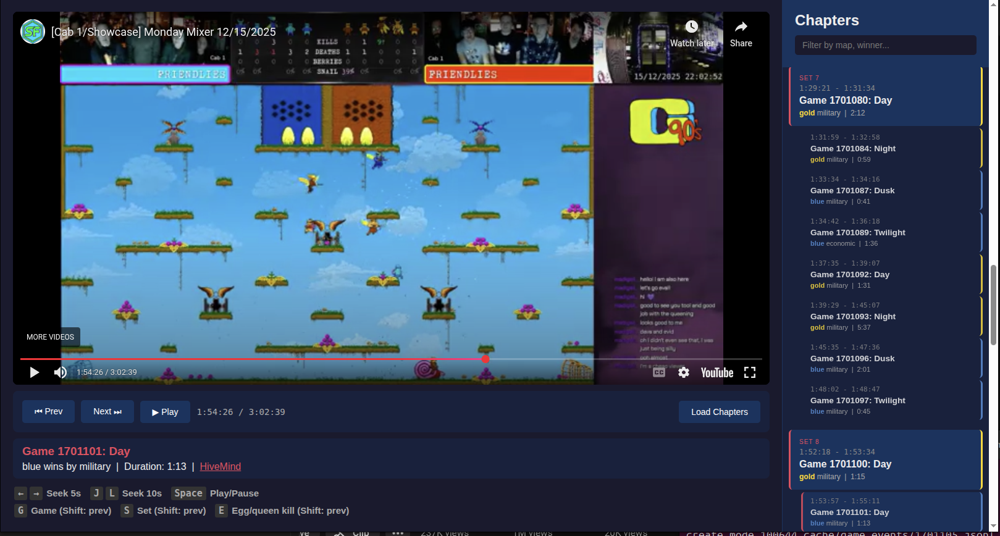

# KQ Stream Highlights

A tool for navigating Killer Queen arcade league night gameplay videos with chapter markers synced to [KQHiveMind](https://kqhivemind.com) game data.



## Features

- **QR Code Detection**: Automatically finds QR codes in post-game screens to sync video with HiveMind data
- **Chapter Navigation**: Jump between games using the sidebar or keyboard shortcuts
- **Set Grouping**: Games are organized into sets based on map rotation patterns
- **Queen Kill Navigation**: Skip directly to queen kills (eggs) across the entire video

## Keyboard Shortcuts

| Key | Action |
|-----|--------|
| `G` | Next game (Shift: previous) |
| `S` | Next set (Shift: previous) |
| `E` | Next queen kill (Shift: replay/previous) |
| `←` `→` | Seek 5 seconds |
| `J` `L` | Seek 10 seconds |
| `Space` | Play/Pause |

## Setup

```bash
pip install -r requirements.txt
```

## Usage

1. Generate chapters from your video:
```bash
python generate_chapters.py <video.mkv> <cabinet_url> chapters.json
```

Example:
```bash
python generate_chapters.py sf_12_15_2025.mkv https://kqhivemind.com/cabinet/sf/sf chapters.json
```

2. Serve the player:
```bash
python -m http.server 8080
```

3. Open http://localhost:8080/player.html

## How It Works

1. **Video Alignment**: Scans video for KQHiveMind QR codes in post-game screens
2. **Time Sync**: Uses the QR code timing + known delay to calculate video-to-UTC offset
3. **Game Fetching**: Fetches all games for that day from HiveMind API
4. **Chapter Generation**: Maps each game's start/end times to video timestamps
5. **Event Extraction**: Pulls queen kill events for frame-accurate navigation
